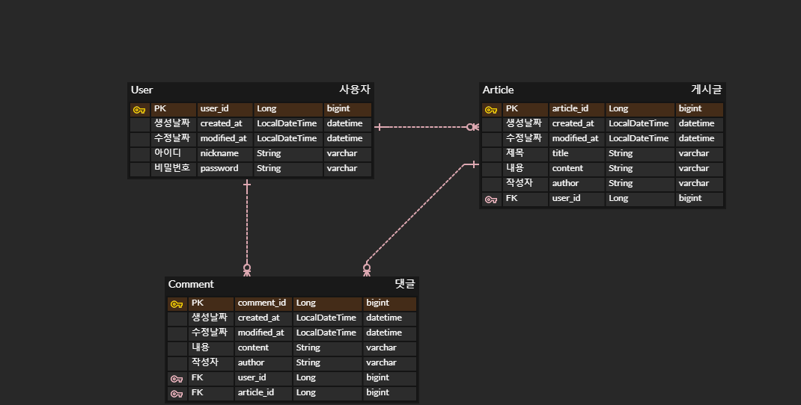

# Innovation Camp Spring Assignment
### 기본 CRUD 구현한 Spring Boot 프로그램(8/12~8/18)
### + 회원 기능 추가 (8/19~8/25)
 

## :fax: ERD

 

## :page_with_curl: API

| 기능                        | Method  | URL                                    | Request           | Response                                |
|-----------------------------|-----|---------------------------------------|------------------------------------------------------------|------|
| 회원가입                     | POST  | /users/signup | 아이디, 비밀번호, 비밀번호 확인   | 성공메세지 + 가입 정보 |
| 로그인                       | POST  | /users/login | 아이디, 비밀번호   |성공메세지 + 로그인 정보|
| 게시글 목록 조회            | GET  | /posts | -   | 성공메세지 + 게시글 목록 정보|
| 게시글 조회                 | GET  | /posts/{id}   | -           | 성공메세지 + 게시글 정보 |
| 게시글 등록                  | POST  | /posts/auth    |  헤더: JWT, 바디: 제목, 내용 | 성공메세지 + 게시글 정보 |
| 게시글 수정                | PUT  | /posts/auth/{id}  |  헤더: JWT, 바디: 제목, 내용 | 성공메세지 + 게시글 정보 |
| 게시글 삭제                | DELETE  | /posts/auth/{id}  | 헤더: JWT  | 성공메세지 |
| 댓글 목록 조회                | GET  | /comments/{id}  | -  | 성공메세지 + 댓글 목록 정보 |
| 댓글 등록                | POST  | /comments/auth/{id}  |  헤더: JWT, 바디: 게시글 id, 내용  | 성공메세지 + 댓글 정보 |
| 댓글 수정                | PUT  | /comments/auth/{id}  |  헤더: JWT, 바디: 게시글 id, 내용  | 성공메세지 + 댓글 정보|
| 댓글 삭제                | DELETE  | /comments/auth/{id}  |  헤더: JWT  | 성공메세지 |
